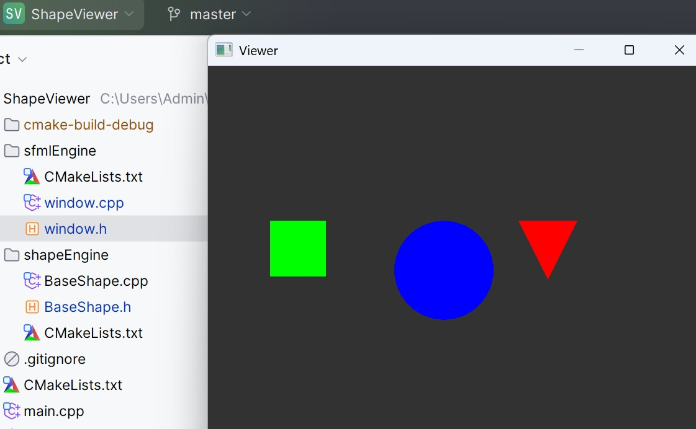

# Описание ShapeViewer

Приложение демонстратор отрисовки разных форм библиотеки SFML.

Включает:
+ RAII (окно SFML)
+ Стратегию наполнения различных фигур с классами BaseShape, ShapeInterface
  (позволят мигрировать при необходимости код для прочих форматов фигур, может быть кастомных)
+ Шаблонный подход типизации данных

# Сборка

+ Сmakelist для сборки проекта

# Вывод результата
